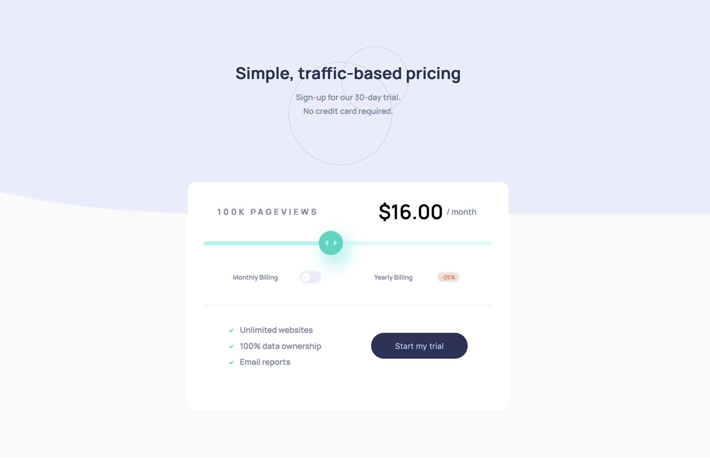

# Frontend Mentor - Interactive pricing component solution

This is a solution to the [Interactive pricing component challenge on Frontend Mentor](https://www.frontendmentor.io/challenges/interactive-pricing-component-t0m8PIyY8). Frontend Mentor challenges help you improve your coding skills by building realistic projects. 

## Table of contents

- [Overview](#overview)
  - [The challenge](#the-challenge)
  - [Screenshot](#screenshot)
  - [Links](#links)
- [My process](#my-process)
  - [Built with](#built-with)
  - [What I learned](#what-i-learned)
  - [Useful resources](#useful-resources)
- [Author](#author)

## Overview

### The challenge

Users should be able to:

- View the optimal layout for the app depending on their device's screen size
- See hover states for all interactive elements on the page
- Use the slider and toggle to see prices for different page view numbers

### Screenshot

### Links

- Solution URL: [Github Repository](https://github.com/llhyuan/Pricing-component)
- Live Site URL: [Github Page](https://llhyuan.github.io/Pricing-component/)

## My process

### Built with

- Semantic HTML5 markup
- SCSS custom properties
- Flexbox
- Mobile-first workflow
- [React](https://reactjs.org/) - JS library
- [Emotion](https://emotion.sh/docs/introduction) - A library to write css in js 
- [Material UI](https://mui.com/) - A React library for Styled/Unstyled components 

### What I learned

1, How to customize Unstyled Material UI(MUI base) components and incoporate them into the project.
2, Organize a react project directory.
3, Write standalone react components and style them independently. 
4, Organize SCSS modules. 
5, Reviewed an element's stacking context to correctly layout the dropdown menu under laptop view.
6, Use gh-page to simplify github page deployment. 

### Useful resources

- [MUI Base](https://mui.com/base/getting-started/overview/) - A great way to start customizing unstyled MUI Base components.

## Author

- LinkedIn - [Hangyuan Liu](www.linkedin.com/in/hangyuan-liu-a9282718b)
- Frontend Mentor - [@llhyuan](https://www.frontendmentor.io/profile/llhyuan) 

